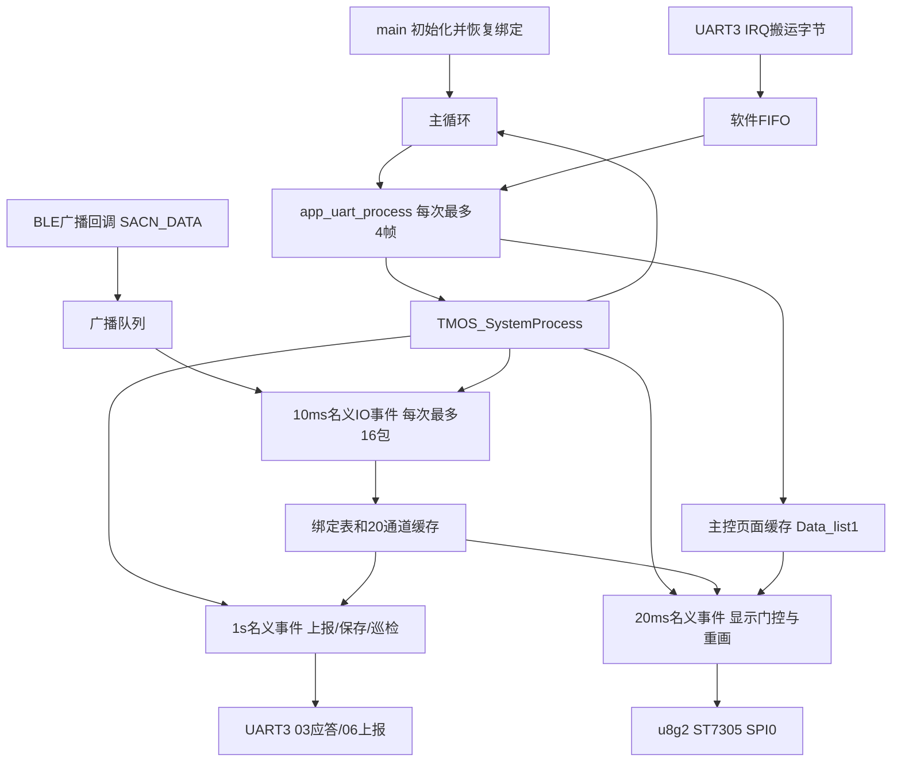

# 当前代码详细分析与修改指南

2026-10-08 最新绑定显示：绑定设备子页直接读取完整绑定表，不再受6条扫描名称缓存限制；全部设备同屏显示，正常最多20个独立设备使用均衡左右两列，不分页、不轮显。保存后返回逻辑保留，验证边界见[绑定设备全部同屏显示](tools/BINDING_ALL_SINGLE_SCREEN.md)。

2026-10-08 绑定扫描后续调整：设备名改为左右两列（左1–3、右4–6），名称前增加`1:`序号；绑定扫描页收到有效0x05保存命令后返回二级设备绑定菜单，保留结果提示，并立即退出绑定扫描模式。实际验证与主控联机边界见[绑定设备两列与保存返回](tools/BINDING_COLUMNS_SAVE_RETURN.md)。

2026-10-08 worktree后续变更：二级“返回主页”右下角新增主控版本号（10显示V1.0），首页本机号保留；一键解绑三级子页改全屏两列，每屏10个设备、保留名称和MAC，序号改为`1:`/`2:`。源码、轮显和本轮验证边界见[返回主页版本号与一键解绑全屏](tools/RETURN_BINDING_UI.md)。本变更先独立同步至`codex/host-binding-ui`，随后按用户授权整合`main`最新无线图标修改并完成合并验证。

2026-10-08 后续界面调整：绑定扫描三级子页同样全屏，解绑顶部显示14px的“总设备数:N台”；20通道页保留“安装调试/信息汇总”和返回按钮，删除“信号/电压/名称”子标题。当前布局、编译与像素回归记录见[绑定全屏与数据子标题调整](tools/BINDING_FULLSCREEN_UI.md)。本文下方旧布局描述以此后续记录和当前源码为准。

分析日期：2026-10-02，按 America/New_York 记录。实际项目：`D:\蓝牙模块优化`。本轮分析基线为 `main` 的 `cc8fcc9c816c1420d58529aee4b864b09794ec9c`，远程为 `git@github.com:vasicambree-png/ttk.git`。

2026-10-07 后续变更：已移除 UI 中无效的 `u8g2_SetFont` 调用，正文仍使用原有位图字模，历史全中文字库不再链接。本文第 10 节关于保留 u8g2 字体上下文的说明属于原分析快照；当前 Flash 占用及前后验证见 [Flash 压缩验证记录](tools/FLASH_OPTIMIZATION.md)。

2026-10-07 三级页面修正：菜单7“返回主页”已可由普通CMD01进入，最少携带 `chu_num2/re_flag` 两项；全屏路由同时检查菜单归属；三级页顶部标题移除，20路同屏采用13px行距和居中数据区。本文相关协议/UI入口已更新，原分析的历史验证数字保留；本轮编译、回归与硬件边界见 [三级页面返回与布局修正](tools/DETAIL_PAGE_FIX.md)。

同日后续按反馈恢复紧凑顶部标题和右上角返回：数据页顶栏占22px，两框183×142px、14px行距；菜单7接收与归属路由修正保留。以下UI说明以此次布局为准，验证见上述记录末尾“紧凑顶栏与右上角返回”。

本文面向后续维护者和 AI：先解释系统如何工作，再给出数据结构、协议、页面和修改入口。结论来自本轮读取的生产源码、头文件、实际生成构建规则和软件测试。源码注释中的历史轮次、性能估算、主控工程核对记录不等同于本轮验证。

本次只新增/维护分析文档及其入口，没有修改固件、通信协议、字体资源或上位机源码，也没有操作串口、烧录或硬件。原有《项目代码功能说明.md》保留为 2026-09-27 历史快照，不能用其中的旧 Git 状态、分页、标度或息屏结论替代本文。

## 阅读路线

- 首次了解：读第 1–4 节，建立主控、BLE、显示和存储的职责边界。
- 修改传感器解析或绑定：读第 5–7 节与第 11 节，再检查 `observer.c`、`observer.h`、`Flash.c`。
- 修改串口/主控联动：读第 8–9 节；同时核对真实主控工程，当前仓库不提供 STM32 的按键/LoRa业务实现。
- 修改 UI、字体或息屏：读第 10 节与第 12 节；不要只依据 `SetFont`、旧分页注释或旧预览。
- 开始具体修改：按第 14 节选择入口和验证范围；先重新核对当前 Git 与源码，本文行号会随修改漂移。
- 已知问题与实测边界：读第 13、15 节，防止把已有实现的限制误认为产品功能。

## 1. 这个工程实际做什么

这是 WCH CH584/CH585 系列 SDK 上的 RISC-V、NoneOS 工程。当前配置名称有混用，实际板上芯片仍需硬件资料确认。应用有四条主要链路：

1. **BLE 传感器链路**：主动扫描广播，识别设备名称和自定义厂商数据，维护 MAC 绑定、20 个通道和异常统计。
2. **UART3 主控链路**：接收外部主控的页面/参数快照及绑定操作命令，回复传感器数据，或主动上报一轮数据。
3. **显示链路**：把主控页面状态和本地 BLE 缓存组合成 384×168 单色界面，走 u8g2、ST7305、SPI0。
4. **存储链路**：将本机绑定表保存到 Data-Flash，开机恢复设备到通道的分配关系。

这里的“绑定”是应用层 MAC/名称/通道登记。当前 Observer 路径没有建立传感器 BLE 连接、执行配对认证或通过 GATT 读取数据。界面的“组网”“上传”“参数保存”“关机”也不能直接理解为 CH584 执行了 STM32 的相应业务。

| 职责 | 实际拥有者 | 在本工程中的表现 |
| --- | --- | --- |
| 页面等级、菜单选择、焦点、主控参数 | 外部主控通过 `0x01` 下发 | 存入 `Data_list1`，由 UI 渲染 |
| BLE 名称、MAC、绑定与实时测量 | CH584 应用 | `g_binding_list`、`CH_com_buf` 等 |
| 本机绑定 Flash 保存/清除 | CH584 应用 | `binding_store_*` |
| STM32 参数 EEPROM、物理按键、LoRa、供电切断 | 当前仓库没有对应主控实现 | 只有字段、按钮外观或提示码，端到端行为尚未验证 |
| UART/显示底层、调度与 BLE 协议栈 | WCH SDK 和应用适配层 | 部分协议栈/ISP 实现为预编译库，不能从应用源码完全解释内部行为 |

## 2. 目录与真实入口

下表链接均相对当前仓库，方便在其他机器复用。

| 文件/目录 | 主要职责 | 后续阅读入口 |
| --- | --- | --- |
| [observer_main.c](CH584_V1_0_1/APP/observer_main.c) | 启动、全局 u8g2、BLE 堆、主循环 | `main` 65 行、`Main_Circulation` 49 行 |
| [observer.c](CH584_V1_0_1/APP/observer.c) | 扫描、广播队列、名称/载荷、绑定、通道、统计 | `Observer_Init` 310、`sacn_process_packet` 1780、`SACN_DATA` 2033 |
| [observer.h](CH584_V1_0_1/APP/include/observer.h) | BLE 应用数据类型、容量、共享接口 | `device_t` 109、`scan_binding` 124 |
| [Usart3_task.c](CH584_V1_0_1/APP/Usart3_task.c) | UART 中断、取帧、协议、任务、显示/存储调度 | `UART3_IRQHandler` 250、`app_uart_process` 367、`usart_ProcessEvent` 435、`parse_received_frame` 908 |
| [app_drv_fifo.c](CH584_V1_0_1/APP/app_drv_fifo.c) | 环形字节 FIFO 与完整帧提取 | `app_drv_fifo_read_pack` 234 |
| [yuying_TFT.c](CH584_V1_0_1/APP/yuying_TFT.c) | 活动页面、字模、格式化、提示、屏幕适配 | `UI_Control` 437、`UI_Main_Display` 659、`UI_Menu_Display` 853 |
| [yuying_TFT.h](CH584_V1_0_1/APP/include/yuying_TFT.h) | `Sensor_Tpye`、`data_LIST`、菜单结构、提示码 | 保留源码实际拼写，不随意改成新的公开符号 |
| [screen_power.h](CH584_V1_0_1/APP/include/screen_power.h) | 无 GPIO/SPI 的亮屏计时策略 | `screen_power_note_page`、`screen_power_is_off`、`screen_power_wake` |
| [Flash.c](CH584_V1_0_1/APP/Flash.c) | 当前绑定镜像和旧存储代码 | 当前入口 `binding_store_save` 480、`load` 577、`clear` 672 |
| `HAL/MCU.c`、`HAL/RTC.c` | BLE 库初始化、RTC/TMOS 时钟、内部校准 | `CH58x_BLEInit`、`HAL_Init`、`HAL_TimeInit` |
| `u8g2/`、`StdPeriphDriver/` | 图形库、控制器与外设驱动 | ST7305、SPI0、UART3 驱动 |
| `LIB/`、`Startup/`、`RVMSIS/`、`Ld/` | 库、启动/向量、内核接口、链接布局 | 当前启动文件为 `startup_CH585.S` |
| [tools/ui_preview](tools/ui_preview/README.md) | 真实 C 绘图的离线预览与布局检查 | `run_preview.py` |
| [上位机验证工具](上位机验证工具/使用说明.md) | C# 双串口验证助手、协议/页面配置 | `src/Protocol.cs`、`src/Program.cs`、`src/ProtocolTests.cs` |

实际 `obj/APP/subdir.mk` 纳入 `Flash.c`、`Usart3_task.c`、`app_drv_fifo.c`、`observer.c`、`observer_main.c`、`u8g2_font_cn.c`、`yuying_TFT.c`。`.mrs/` 是 IDE 快照；`tools/ui_preview/*/ui_under_test.c` 是宿主副本，不是正式修改入口。

## 3. 开机、主循环与协作式调度

`main()` 的实际顺序：

```text
DCDC（受宏控制）→ HSE 电容/系统时钟 → UART1 调试口
→ CH58x_BLEInit → HAL_Init → u8g2Init
→ 512 字节 UART 软件 FIFO → Usart3_Init → usart_task
→ GAPRole_ObserverInit → Observer_Init → binding_store_load
→ Main_Circulation
```

主循环非常简单：

```c
while (1) {
    app_uart_process();
    TMOS_SystemProcess();
}
```

TMOS 是协作式事件调度。不是每项业务都有可抢占的线程；当前函数若同步等待 SPI、UART 或 Flash，其他任务就可能延后。移动阻塞操作到秒事件只改变位置和频率，不证明 BLE 已完全不受影响。



| 事件 | 标识/名义时间 | 实际工作 |
| --- | --- | --- |
| IO | `START_IO_EVT=0x0001`；首次 800 tick=500ms，随后16 tick=10ms | 消费广播、累加刷新心跳；每20次请求本地重画 |
| DATA | `START_DATA_EVT=0x0002`；32 tick=20ms | 处理显示开关、消费重画请求 |
| TIMER | `START_TIMER_EVT=0x0008`；1600 tick=1s | 帧龄/FIFO超时、扫描模式、初始化/清Flash、提示、03/06、自动保存、名称巡检及诊断 |
| Observer 启动 | Observer 任务 `START_DEVICE_EVT` | 启动 Observer 角色，扫描由角色事件开始和重启 |
| HAL 校准 | 配置 `BLE_CALIBRATION_PERIOD=120000ms` | RF/内部 RC 校准，不是外部传感器标定 |

SDK头文件定义任务定时单位为625µs。事件处理后重新启动定时，阻塞负载会影响实际间隔；上述名义节拍不能当作实测吞吐、延时或刷新率。

进入main之前，`Startup/startup_CH585.S`设置gp和RAM顶部sp，搬运RAM执行初始化段、highcode和data，清bss并配置中断/向量，再进入main。`Ld/Link.ld`的stack段提供RAM顶端栈指针，没有单独固定大小的栈保留区；不能把链接器报告的静态RAM剩余量当作已经验证的最大栈余量。

## 4. 数据结构、容量与所有权

| 对象 | 谁写入 | 谁读取 | 正确理解 |
| --- | --- | --- | --- |
| `Data_list1` | `parse_received_frame` | UI、页面绑定模式、亮屏策略 | 主控下发的显示/参数快照，不是 BLE 全部真实测量源 |
| `g_binding_list[32]`、`g_binding_count` | 绑定、开机恢复、清绑定 | 数据解析、UI、Flash、新鲜度 | 设备级 MAC/名称/类型/通道映射 |
| `CH_com_buf[20]` | 通道占用/恢复、成功载荷解析、清绑定 | 首页、名称/RSSI/电压页、03/06组包 | 通道级原始测量缓存 |
| `g_adv_q[64]` | 回调发布 tail，消费端推进 head | `observer_adv_drain` | 原始广播工作队列，实际63槽可用 |
| `g_dev_fresh[]`、`g_dev_miss[]` | 03请求/应答与成功设备数据 | 03等待条件 | 设备级请求轮次状态，不是自然秒离线计时 |
| `g_round_mask` | 成功通道数据置位，上报后清除 | 06完成/兜底条件 | 通道级主动上报轮次，独立于03 |
| `g_name_snap[]`、名字错误表 | 有名称的包、周期巡检 | 告警UI、调试日志 | RAM监测；不改变绑定，也不保存到Flash |
| `dis_flag_cnt` | UART/周期/唤醒/提示等置位 | DATA事件消费 | 多个请求合并成一次，不按收到帧数排队重画 |
| `screen_power`、`Rx_sleep_flag` | 策略输入与DATA事件 | 物理开关、绘制门控 | 显示关闭不等同于 MCU 睡眠或供电关闭 |
| `g_ui_msg` | 主控提示、本地保存/清除结果 | 提示绘图、倒数 | 覆盖普通页面的独立提示层 |

`device_t` 含 MAC、30字节名称、`Sensor_Tpye`、`uint16_t CH_data`、`uint8_t voltage/rssi`、`valid`、`data_re_flag`。`valid=1` 表示已分配通道；`data_re_flag=1` 表示收到过值，不能自动代表此刻在线或本轮新鲜。

`scan_binding` 的 `frist_ch_num` 是源码实际拼写，内部为0基起点；`ch_num` 是该设备占用路数。`MAX_DEVICES=2` 对应旧 `device_list`，不等于当前最大绑定数。结构体的 C 内存布局也不等于 Flash 或 UART 格式；持久化和通信都由代码显式编码。

`UI_main.data[20]` 和 `Menu_rank4.shishi_buf[20]` 仍可由主控参数写入，但当前首页及名称/RSSI/电压页实际使用本地 `CH_com_buf`。修改时不能因为字段名字叫 data 就替换真实数据源。

## 5. BLE 扫描、队列与模式

### 5.1 当前扫描设置

`Observer_Init` 配置主动扫描、全部发现模式、无白名单；interval/window均240，即150ms/150ms。实际 `DEFAULT_SCAN_DURATION=12800`，即8秒，扫描完成事件再次启动。旁边“duration=0持续扫描”的旧注释不能代表当前宏。

`ObserverEventCB → SACN_DATA` 只复制当前包的 MAC、eventType、RSSI 和最多64字节原始数据。队满丢最新，计入 `g_adv_q_drop`；消费者 `observer_adv_drain(16)` 按 FIFO 顺序解析。`g_adv_seen` 是成功入队后置位，`g_adv_rx_cnt` 也可能包含因队满丢弃的回调包。

当前绑定、名称解析、通道更新在消费端的 usart TMOS 任务上下文执行；旧注释中“add_binding在BLE回调”已不准确。后续不要把解析、Flash或整屏发送放回广播回调。

### 5.2 绑定模式由什么控制

秒事件检查：

```c
menu_rank == 3 && rank2_addr == 2 && UI_main.re_flag == 2
```

满足为 `SCAN_MODE_BIND`，否则 `SCAN_MODE_DATA`。`rank3_addr` 只是焦点，不能替代子页标识；当前没有开机30秒绑定窗口。模式在秒事件更新，队列按消费时模式处理，因此页面变化并不立即改变所有已排队包的处理方式。

| 模式 | 当前行为 |
| --- | --- |
| DATA | 未绑定MAC先丢弃；已绑定MAC按旧记录解释payload，数据包可不带名称 |
| BIND | 本包必须有包含SW_的候选名称；更新扫描名称缓存，尝试绑定并写数据 |

扫描名称缓存只保留最近6条，同MAC刷新置顶；能显示名称不证明该设备已成功绑定。`g_scan_enable` 只门控入队/处理，它不是调用停止射频扫描的 API。

### 5.3 AD 解析与分包限制

广播按 `[Length, Type, Value]` 遍历。名称同包优先0x09完整名、再0x08简称，必须包含 `SW_`；厂商载荷取第一个0xFF段的Value，**没有跳过公司ID两个字节**。对端格式必须与此实际解释一致。

当前没有跨 ADV/SCAN_RSP 的名称和载荷合并。BIND下无名包直接返回；新JG绑定还需要同包至少9字节载荷判定1路/4路。若名称和数据分在两次回调，不能假设本工程会自动合并。DATA模式的已绑定设备可以从不带名称的数据包更新。

## 6. 名称、绑定与广播数据

### 6.1 名称规则与枚举

核心名称为 `SW_<TYPE>_<host>_<start>[_<end>]`；解析器允许前缀/后缀，并尝试不同的SW_位置。无end默认为1路；外部1–20通道转换成内部0–19索引。

例如 `SW_MG_1_1` 对应起点0、1路；`SW_WY_25_9_12` 对应起点8、4路。名称最多保存29字节加终止符，按字节截断不等于UTF-8安全截断。

| 枚举值 | 符号/名称 | 当前主页显示单位与标度 |
| --- | --- | --- |
| 0 | `TPYE_NONE` | 占位 |
| 1 | `TPYE_MG` 锚杆 | kN，raw/10，一位小数 |
| 2 | `TPYE_JG` 激光 | mm，raw原值 |
| 3–6 | `TPYE_WY2/WY4/WY6/WY8` 位移 | mm，raw/10，一位小数 |
| 7 | `TPYE_LF` 裂缝 | mm，raw原值 |
| 8 | `TPYE_QJ` 倾角 | °，先按int16解释，再/10，一位小数 |
| 9 | `TPYE_YL` 应力 | MPa，raw/10，一位小数 |
| 10–13 | `TPYE_YW/WZ/DY/KK` 液位/微震/地音/测试 | 单位空，raw原值 |
| 14 | `TPYE_END` | 上界标记，不是有效类型 |

WY名称范围为4/6/8路时选对应枚举，其余归WY2；不是严格只允许2/4/6/8路。JG路数随后按payload判定，可能覆盖名称范围数量。host目前保存但不作为主机号过滤条件。

名称数字累计后先转uint8再检查，因此257可截成1、host>255也会截断。这里不能写成“已严格验证原始通道数字1–20”。修改此路径时要先校验完整数字，再处理窄类型和通道边界。

### 6.2 绑定状态转换

`add_binding` 的主要判断：

```text
已有同MAC：字段一致→复用；字段改变→保留旧绑定布局，仍返回旧索引
新MAC：拒绝同名/通道容量不足/区间越界或被其他MAC占用/绑定表满
通过：追加绑定→occupy_channels→初始化fresh/miss/名字快照→置dirty
```

绑定表32条与通道容量20是两个限制。每个设备至少占1路，不能把32条上限宣传成可同时占用32个独立测量通道。`channels_available` 允许空通道或同MAC已有通道；运行绑定和异常Flash恢复还需分别检查。

占用/开机恢复只建立元数据和valid，测量值尚未收到。成功新绑定置 `g_bind_store_dirty`，并不当场证明Flash已经保存。改变同MAC名称或通道不会自动迁移，需先明确是否要更改现行兼容行为。

### 6.3 payload格式

| 设备路径 | 当前实际最低长度 | 字段解释 |
| --- | --- | --- |
| 普通类型 | `2*ch_num+1` | 首ch_num个大端u16；电压取整个payload最后一字节；多余中间字节忽略 |
| JG | 9字节 | 0..1激光；2..3、4..5、6..7三倾角；第8字节电压 |
| JG判路数 | 9字节 | 三倾角均0xFDFD为1路，否则4路；不足9不能完成判型 |

成功写入后设置 `CH_data`、`voltage`、RSSI和`data_re_flag`，相应通道轮次位图置位；写入至少一路后设备fresh=1、miss=0。缓存保留原始u16，缩放发生在 `ch_disp_format`，不能提前在BLE层/上报层除10。

JG设备绑定Type为JG；实时写值后首通道Type=JG，后三路Type=QJ。恢复/初次占用时通道Type先都等于设备Type，首页 `ui_home_channel_type` 能从4路JG绑定推断后三路QJ；03/06却直接取通道缓存Type，首包前类型可能与首页展示不同。这是当前实现差异，不是已验证的对端兼容结论。

## 7. 新鲜度、03请求、06上报与异常统计

### 7.1 两套收齐条件不要混用

| 机制 | 统计单位 | 起点/结束 | 离线或超时含义 |
| --- | --- | --- | --- |
| 03 `fresh/miss` | 设备 | 受理03清fresh；发送后更新miss并清pending | miss达3后不再等该设备，本地旧值仍保留 |
| 06 `g_round_mask` | 通道 | 成功通道数据置位；发06后清位图 | 全部在用通道收齐，或有数据且达到10个秒事件兜底 |

03请求若已有pending则忽略，不重置计时、不清fresh、不排队。每秒满足“所有miss<3设备fresh”或30个秒事件超时即响应；无绑定为空集合，下个秒事件可返回全空数据。应答后没有fresh的设备miss+1封顶3，有fresh归0。成功广播也会归0。

**miss是03应答轮次，不是自然秒数。** 不请求03就不会仅因时间流逝逐秒累加miss；达到3也不清valid或旧数值。fresh按设备至少一路写入判定，不等于该设备所有通道逐一完整更新。

06只有存在绑定才检查；全部valid通道位图收齐即发，或者有新数据且距上次上报≥10个秒事件时发。完全无新数据不会固定10秒发空报告。06不推进03的miss；两套状态独立，同一个秒事件可能先06再03发送两帧。

### 7.2 名称与电压告警究竟数什么

- 名字快照按绑定索引记录最近候选名；每600个秒事件比较一次。同MAC同旧/新名的错误记录合并hit，其他新增记录最多16条并环形覆盖，全部在RAM。
- `g_name_err_count` 是当前错误记录数；`hit_cnt` 是巡检重复命中数，不是广播包数。窗口内先改名后恢复可能不报，改成不含SW_的名称不会更新这条候选路径。
- `g_volt_err_count` 在成功填包且原始电压字节为0时增加，同包多通道只算一次，饱和255。它是异常包次数，不是异常设备数，也没有低电压阈值模型。
- 首页报警显示上述两个计数的和；不代表不重复设备的故障总数。解绑会清这些RAM统计。

### 7.3 诊断日志的解释

`observer_ble_stat_tick` 每秒维护摘要/静默看门狗；成功入队静默达10个秒事件后尝试扫描重启。SUCCESS计rst，`bleAlreadyInRequestedMode(0x11)`计busy，其他错误计err。busy增长可能只是无广播源且扫描本来就在跑。

`g_adv_q_max` 是历史峰值，不是当前队列长度；drop有饱和保护，部分其他u16计数长期可能回绕。reject只覆盖add_binding的特定拒绝，名称语法失败/JG缺payload不一定计入。

当前 `BLE_DIAG_LOG=1` 每5个秒事件打印诊断和缓存名；逐包日志默认关闭。rx增长只能证明回调有包，不能证明所有目标设备接收正常。诊断打印本身也可能影响协作式任务时序。

## 8. UART硬件、取帧与协议

### 8.1 硬件和接收路径

| 接口 | 当前源码映射 | 用途 |
| --- | --- | --- |
| UART3 | PA5 TX、PA4 RX，115200、8N1 | 外部主控协议 |
| UART1 | PA9 TX、PA8 RX，DEBUG配置下默认115200 | 调试日志 |
| SPI0 | PA13 SCK、PA14 MOSI、PA12 CS | 屏幕；默认映射与TFT初始化 |
| 屏幕DC/RST | PA2 DC；PA3 RST宏 | GPIO reset回调为空，初始化置高未执行复位脉冲 |
| 其他输出 | PA1置高、PB0/PB1置低 | 当前片段没有给出物理用途，不推断供电功能 |

上述是代码映射，不是实板接线确认。MCU晶振、射频、SWD/WCH-Link及电源引脚需要板卡资料，不能混入应用GPIO列表当已验证配置。

`UART3_IRQHandler` 在RECV_RDY/TOUT中排空硬件FIFO，借 `TxBuff[200]` 搬运到 `app_uart_rx_buffer[512]`；变量名TxBuff在这里实际用于接收。ISR不解析、不绘图、不保存。

`app_uart_process` 每轮最多提取4帧，随后让出主循环给TMOS。软件取帧找到 `AA EE`，读LEN，等待完整字节、校验SUM/尾；错误候选跳过AA继续同步，找不到头时保留最后1字节。超时按未成功取帧的秒事件计数，`>4`后flush，不是逐字节空闲计时。

### 8.2 通用封装

```text
AA EE | LEN_H LEN_L | CMD | DATA... | SUM | 0A
LEN = 1 + DATA字节数
整帧字节数 = LEN + 6
SUM = CMD至DATA末尾逐字节相加的低8位
```

LEN、UI u16参数和传感器数据均大端。`calculate_checksum` 实际是累加，不是其旧注释中的异或。通信SUM也不同于Flash的sum16。

### 8.3 命令方向、动作与反馈

| CMD | 主控→CH584 | CH584→主控 | 当前副作用与限制 |
| --- | --- | --- | --- |
| 01 | 页面/参数/提示/重初始化 | 无响应帧 | 更新显示缓存与策略，不能当真实业务操作ACK |
| 02 | 接收空分支 | 无 | 没有单双通道设置动作，不沿用其他旧项目的cmd02含义 |
| 03 | 固定7字节请求 | 87字节通道应答 | 受理后等新数据/30个秒事件；无立即ACK |
| 04 | 固定7字节 | 8字节状态 | RAM立即清；Flash秒事件延期擦；00此前有绑定、01此前为空 |
| 05 | 固定7字节 | 8字节状态 | 同步保存与回读；00成功、01无绑定、02失败；本地结果提示 |
| 06 | 没有接收case | 87字节主动报告 | 与03载荷同构，方向为本机主动发送 |
| 07 | 固定7字节 | 8字节状态 | 当前同步清RAM/Flash；00/01仅说明清前是否有绑定；失败日志不改变状态码 |
| 其他 | default忽略 | 无 | 08/09等不是已实现命令 |

04先回状态不证明后来Flash擦除成功；07当前不是延期清除，顶部注释“04/07均延期”已过时。07也不能重置主控所有参数。执行04/05/07具有存储/绑定副作用；本文十六进制示例用于理解，不会自动发送。

### 8.4 CMD01字节布局与完整验证

```text
偏移0..3  AA EE LEN_H LEN_L
偏移4..9  01 Type menu_rank rank2 rank3 param_cnt
偏移10起  param_cnt个u16（高字节在前）
随后      SUM 0A
LEN=6+2*param_cnt；整帧=12+2*param_cnt；param_cnt<=30
```

当前解析先检查指针/最小封装、头尾/LEN；CMD01还要求至少12字节、参数数量与LEN精确匹配、SUM正确，再检查各页面最少数量，最后写页面状态和亮屏策略。旧说明中的“首页只检查5个参数”“验证之前先写页面”等已被当前预验证修正，不能当当前缺陷继续引用。

但 `app_uart_process` **没有检查解析返回码**，只要FIFO提取成功就置重画请求。被页面解析拒绝、cmd02或未知CMD也会请求重画；它们不会因此清掉帧龄或更新亮屏策略，后续仍受门控限制。`parse_received_frame`最终返回0也不等同于命令已执行或硬件已成功。

| 解析返回码 | 当前来源（不是线协议ACK） |
| --- | --- |
| 0 | 正常结束，也包括02/未知命令忽略、03在途忽略，以及04/05/07非法LEN/SUM分支break；不代表业务成功 |
| 1/2 | 1为空指针/不足7字节/帧头尾错误；2为LEN与实长不一致 |
| 4/6 | 4为01校验和错；6为01不足12字节、参数计数/LEN结构不符或超过30参数 |
| 5 | 首页不足10参数；菜单号越界或低于菜单最低总参数数 |
| 10/11 | 10为未支持的menu_rank；11为rank6缺少提示参数 |

### 8.5 CMD01参数映射

首页rank1最少10个固定u16，顺序为：

| 索引 | 字段 | 说明 |
| --- | --- | --- |
| 0 | version | 缓存版本，当前首页没有绘出版本栏 |
| 1 | vbat | 主控电池，按百分之一V格式显示 |
| 2 | host_num | 本机号 |
| 3 | send_host_num | 发往地址/特殊值 |
| 4 | sub_num | 分站号 |
| 5 | state | 接收后窄化到u8；1显示开机 |
| 6 | Lora_rssi | 接收后窄化到u8；当前首页没有信号栏 |
| 7 | chu_num1 | 首页页码，2为后10路，其余前10路 |
| 8 | chu_num2 | 菜单旧页码缓存 |
| 9 | re_flag | 子页标识，接收后窄化到u8 |
| 10..29 | UI_main.data[0..19] | 可选主控数值缓存；未提供的尾槽保持原值，当前首页不直接绘它 |

rank2/3的参数块**最后两项**统一是 `chu_num2`、`re_flag`，业务参数在前：

| rank2 | 当前菜单名 | 前部业务参数顺序 | 最少总数 |
| --- | --- | --- | ---: |
| 0 | 地址分区 | set_host_num、set_sub_num | 4 |
| 1 | 组网测试 | xuhao_num、now_host_addr、text_host_addr、text_cnt、bl_numl、net_flag | 8 |
| 2 | 设备绑定 | biaoding_ad[3][2]按点/双路顺序6项；pass_buf[4]；pass_flag；biaoding_flag[3] | 16 |
| 3 | 安装调试 | shishi_buf[20]、kaer_time | 23 |
| 4 | 上传设置 | old_send_addr[3]、new_send_addr[3] | 8 |
| 5 | 其他设置 | power、time_light、state | 5 |
| 6 | 信息汇总 | len_value[3]、ad_value[3]、old_len、new_len | 10 |
| 7 | 返回主页 | 无业务参数，仅公共 chu_num2/re_flag | 2 |

菜单名替换后仍沿用旧业务结构和线协议；例如设备绑定页继续接收旧标定块，信息汇总继续接收旧置零块。这不是建议删掉“看似无用”的参数。生产解析按最低数量接受，末尾两项取实际param_cnt尾部；当前C#页面校验有自己的更严格规则，双方不能仅凭结构名推断兼容。

rank4是保存/重启文字页，不在本机执行主控重启；rank5置重初始化请求并唤醒，真正初始化在秒事件；rank6最少1个u16，取低字节作为提示码，保留原 `Data_list1` 页面字段。2026-10-07起，rank2/3协议校验接受菜单0..7，第7项“返回主页”只读取公共尾参，显示返回确认页；实际确认返回仍由主控下发rank1首页帧。

rank5会把普通页面缓存的menu_rank改为5；UI_Control的rank5分支不画普通内容，清缓冲后仍SendBuffer。没有优先提示时可能出现空屏，需主控再发rank1/2/3真实页面；只有rank6明确保留上一普通页面，不能将两者混淆。

### 8.6 CMD03/06载荷与离线例子

```text
AA EE 00 51 03或06
20 × [type, data_hi, data_lo, voltage]
SUM 0A
```

80字节载荷、87字节整帧，无通道数字段。通道i（0基）的type在帧偏移 `5+4*i`。组包仅检查valid和Type非NONE；不检查data_re_flag、fresh、miss或时间。空通道四字节0；恢复后未收到数据或掉线旧值也可能作为有效类型回传，载荷不带RSSI、MAC、名字、在线位或接收时间。

| 离线示例 | 十六进制 |
| --- | --- |
| 请求03 | `AA EE 00 01 03 03 0A` |
| 主控提示“参数保存成功” | `AA EE 00 08 01 00 06 00 00 01 00 01 09 0A` |
| 查询后的合法空03应答 | `AA EE 00 51 03` + 80个`00` + `03 0A` |

87字节在115200/8N1线上的理论时间约7.55ms。`UART3_SendString`轮询硬件FIFO且不显式等待最后一字节离线，不能把理论线上时间直接写成CPU实测阻塞时间。

## 9. 刷新、提示和真实关屏

### 9.1 三个独立概念

1. **重画请求**：UART取帧、周期和唤醒等置 `dis_flag_cnt=1`，重复请求合并。
2. **画面新鲜度门控**：`g_frame_last_sec<=5` 才可画；所有接受的01都清帧龄，超时停止刷新但不单独执行PowerSave。
3. **亮屏时间策略**：按TMOS绝对时钟计算导航活动期限，DATA事件负责实际 `u8g2_SetPowerSave`。

IO每20次名义200ms请求本地更新；DATA每20ms检查，距离上次画至少5个10ms心跳才绘制。息屏或帧龄过旧时清绘图请求；串口/BLE/存储继续执行。纯UI修改不应该把数据接收改为“只有亮屏才处理”。

### 9.2 活动与唤醒

`screen_power_note_page` 比较首次页面、rank/menu/focus/page/subpage/time_light变化；只有这些可识别变化续亮。电池/RSSI/数值更新以及同页面同焦点周期帧不续亮。当前协议没有独立按键活动码，同字段按键无法和刷新帧区分。

time_light=0在已经seen页面后常亮；三级页面rank=3选择期间持续亮屏，退出到其他普通页面时由rank变化重新按time_light计时；其他普通页面1..65535按秒计时。首次合法页面前seen=0保持关屏。到期后expired锁存，完整时钟回绕不会自动唤醒；rank5可显式wake。rank6提示自身不续亮，04/05本地提示也不会单独唤醒已过期显示。rank5/6不替换策略记录的最近普通页面，最近普通页为三级时保持亮屏，直到下一合法普通页退出三级。

time_light来自rank2/3 menu5第二业务参数；重启默认0，主控需重新下发已保存设置。CH584绑定Flash不保存这项主控配置。初始化本身先开屏/清屏，随后 `usart_task`关屏，不能描述成“开机直到收到主控之前绝不访问屏幕”。

当前ST7305 PowerSave走显示OFF/ON命令0x28/0x29；不切断MCU/屏幕电源，也不等同于SDK HAL_SLEEP。帧龄门控与关屏计时独立，常亮时主控断发可能留下旧画面。

### 9.3 提示优先级与持续时间

`UI_Control`先ClearBuffer；g_ui_msg非0则画提示、SendBuffer并return，否则按普通rank画页。提示期间01普通页面仍更新缓存，提示结束回到最新状态。

| 码 | 文案/含义 | 自动倒数 |
| --- | --- | --- |
| 0 | 清提示 | 立即清除 |
| 1/2 | 参数保存成功/失败，主控通知 | 普通2个秒事件 |
| 3/4/5 | 绑定保存成功/失败/无绑定可保存 | 普通2个秒事件 |
| 6/7 | 绑定清除成功/失败 | 普通2个秒事件 |
| 8 | 长按K1+K3开机 | 常驻，需msg0 |
| 9 | 正在关机中 | 常驻，需msg0；不在本机倒数5秒断电 |

普通2tick不保证墙钟完整2秒；例如延期清Flash产生的提示会在同一次秒事件被立即倒减。提示也受屏幕/帧龄门控，不保证用户每次都实际看到。

## 10. UI页面、字体和资源

### 10.1 当前页面路由与焦点

`Main_List`/`Menu_List`定义八个回调：地址分区、组网测试、设备绑定、安装调试、上传设置、其他设置、信息汇总、返回主页。旧探头标定/置零函数仍在文件内但没有挂载到活动菜单。UI_Control虽然接受list指针，很多子函数直接读全局Data_list1；不能把它当作完全无全局依赖的通用组件。

rank2左菜单高亮；rank3右侧控件高亮。2026-10-07起，仅菜单3且re_flag=3/4、菜单6且re_flag=5提前走全屏数据页并恢复绘图状态；跨菜单残留标志不会抢占其他菜单。后续恢复三级页紧凑顶部标题，二级菜单保留原导航与标题。

| 页面 | 真实绘图入口 | 焦点/子页与数据 |
| --- | --- | --- |
| 首页 | `UI_Main_Display` | chu_num1=2显示11–20，否则1–10；主控顶部字段+本地BLE通道 |
| 地址 | `addr_Control` | 0/1分站标签/值；2/3本机标签/值；4保存并重启；5不保存返回 |
| 组网 | `networking_Control` | net_flag=0选操作，否则显示测试参数；操作焦点0开始、1返回、2重置、3保存 |
| 设备绑定 | `binding_Control` | 主列表焦点0数量、1解绑、2绑定、3返回；re=1解绑确认列表、re=2扫描列表 |
| 安装调试 | `install_Control` | 0信号、1电压、2返回；re=3/4全屏20通道 |
| 上传 | `uploading_Control` | 0..2三组新地址，3保存，4返回；旧地址只读 |
| 其他设置 | `Other_Settings_Control` | 0/1功率、2/3亮屏时间、4/5通信状态、6保存、7返回 |
| 信息汇总 | `summary_Control` | 0名称、1名字告警、2电压告警、3恢复出厂、4返回；re=5名称，re=6确认 |
| 返回图案 | `return_main_Control` | 静态返回资源，三级页以14px紧凑标题替换位图内原大标题；普通协议menu7可进入，确认后的首页帧仍由主控下发 |

当前解绑列表每次最多10台，每台名称/MAC两行，以 `(g_name_chk_sec/4)%pages` 名义4秒轮显；绑定设备子页直接显示全部绑定名称，同屏显示且不受该时基或6条扫描名称缓存影响。正常独立设备最多20台，名称按左右两列均衡排布；异常恢复的超过20条记录使用紧凑四列兜底，最多32条也不遗漏。直接设rank3=0、re=0并不会自动进入已绑定列表，旧注释“rank3==0就是列表”不符合当前 `binding_Control` 分支。

### 10.2 首页与20通道数据页

首页两页各10路，两列各5行，18px数据、22px行距，信息栏14px。2026-10-08后续布局调整：第一页右上电压通常16px，文字宽度超过58px时回退14px以完整保留长数值，右锚376、基线29；无线图标按参考图比例增至29×21、顶部10；实际电压字宽超过46px时采用21×17紧凑图标、顶部14。图标位于电压左侧并间隔3px。第二页状态:开机/关机位于右上角，14px、右锚372、基线23。下方两页信息栏均基线44，左锚108、右锚366，相比原布局各向中间内收6px：第一页为分站号/本机发往信息，第二页为绑定数与独立“台”单位/已用通道。绑定数字与“台”留4px间距，第二页不显示电压、无线图标和报警。顶部每翼两条斜线，版本仍不显示。

无线图标读取主控CMD01首页参数索引6的`UI_main.Lora_rssi`，本次显示约定为1弱、2中、3强；0或其他不支持的值均显示原无线图标加斜杠，不再显示问号。当前仓库没有独立Wi-Fi联网状态，也没有证实主控按0–3档发送；这个显示约定与真实主控信号意义的对应尚未验证，不取BLE设备的RSSI冒充主控无线状态。

首页 `ui_home_channel_type` 优先从绑定区间得类型，再以通道缓存类型兜底；4路JG后三路推断QJ。尚未收到值仍显示已知类型/单位，值为`--`；valid和data_re_flag成立则显示真实值，包括0和负倾角。未知类型显示占位，不改写数据。

名称、信号、电压三级页当前**一屏20通道**，左1–10、右11–20，11px文字、14px行距，两数据框从y=22开始、各183×142px，编号和数据分别居中；顶栏标题14px、子标签11px，75×18px返回按钮位于右上角。chu_num2=0/1/2/65535不改变通道集合；首页仍分页。旧主控第一次确认若只改页码，画面不变，可能还需第二次确认退出；一次确认返回需检查实际主控状态机。

名称只要求已分配且非空，可先于遥测显示；信号/电压要求valid和data_re_flag，否则`--`。信号按int8恢复负dBm，设备电压按十分之一V显示；首页主控vbat是百分之一V，两者不要混用。

### 10.3 普通文字真正使用的字模

普通文字链路为：

```text
ui_text_width / ui_text_draw → ui_main_meta_code
→ ui_text_glyph二分查表 → ui_menu_glyphs_11/14/16/18
→ u8g2_DrawXBMP
```

普通正文由自定义位图字模绘制。2026-10-08补入“台”后，四个字号表共235个相同且有序码点，包含`?`回退；查找上界共用14px表数量，新增字符时要同步所有表。旧`UI_FONT_CN`/`u8g2_SetFont`上下文说明见本文开头的Flash优化版本说明。

正文资源来自 [generate_menu_assets.py](tools/generate_menu_assets.py)，使用已有字体、公共基线与降采样二值化；从源码字面量收集中文/全角，并加可打印ASCII及指定符号。它不能保证任意外部蓝牙名称的Unicode覆盖。

`ui_main_meta_code`只处理1/2/3字节序列；名称先按字节容量复制，随后按解码字符及像素宽度裁剪。四字节字符、残缺编码、容量截断落入多字节中间尚未验证，不能声称任意UTF-8安全。名字排版使用本地副本，不能为裁剪改写绑定名。

### 10.4 资源、位序和共享布局

首页标题/Logo资源为 `ui_home_assets.h`，来源 [generate_home_assets.py](tools/generate_home_assets.py)；菜单字模、图标和返回图案为 `ui_menu_assets.h`。生成器会覆盖正式头文件，只有改相关字体/素材时才运行，先检查输入、字体与输出路径。

无线图标单独来自[generate_wireless_assets.py](tools/generate_wireless_assets.py)，生成`ui_wireless_assets.h`的29×21px主图与21×17px紧凑图XBMP，分别逐行4/3字节、每档84/51字节；档位由当前主页面选择，资源不包含运行时数据。

XBMP逐行、每行ceil(width/8)字节、低位对应左像素；u8g2内部帧缓冲另有组织形式，不能直接复制原始字节替换。当前原生控制器168×384、U8G2_R3旋转后逻辑384×168，全缓冲8064字节。字模y为基线，位图y为左上角，坐标/宽度链要能容纳右栏>255的位置。

当前完整重绘，无活动的旧页面局部像素缓存/XOR恢复方案。`ui_text_draw`恢复位图透明模式，`UI_Menu_Display`恢复位图/文字透明和颜色；修改公共绘图应验证连续与独立重画。参数页虽有PARAM常量仍复用HOME_CELL起点/右边界，改HOME坐标也可能影响参数页。

Logo的原图斜体字母有横向重叠，生成器用连通笔画分离而非空白列切分，保留i点和下伸笔画。具体连通块数/阈值是当前素材的要求，不要移植到其他Logo当固定规则。

## 11. Flash格式、保存、恢复与清除

### 11.1 当前镜像

Data-Flash偏移0，擦4096字节，固定镜像1288字节：

| 偏移 | 长度 | 编码 |
| --- | ---: | --- |
| 0..3 | 4 | `CHBD`即43 48 42 44 |
| 4 | 1 | 版本1 |
| 5 | 1 | 绑定条数 |
| 6..7 | 2 | 全镜像sum16，小端；计算跳过自身 |
| 8+40*i | 6 | 第i条MAC |
| +6 | 30 | 名称 |
| +36..39 | 4 | type、host、0基start、ch_num |

未使用条目置0且参与校验；显式字段编码不使用结构体memcpy。sum16是累加，不是CRC。当前静态缓冲4字节对齐、API使用`__HIGH_CODE`；后续修改要保留ISP对RAM缓冲、对齐及擦除块的要求。

BLE SNV另在偏移0x7000，HAL SNV写回调会擦所在整块。绑定块与SNV块当前分开，不能因为只配置256字节SNV就把该块剩余空间随意分配。

### 11.2 保存和自动保存

```text
count=0 → EMPTY（不擦旧镜像）
非空 → 组镜像/校验 → 整块擦 → 写 → 回读逐字节Verify
第一次写失败 → 再擦写一次；仍失败或回读不符 → FAIL
```

手动05同步保存并给00/01/02结果。新增绑定只置dirty，秒事件先清dirty再调用save，当前不检查返回值、不恢复dirty、不给自动保存失败提示。这是每秒合并请求，不是最后一次变化后严格等待稳定一秒。

当前单块擦后写，无双备份或提交标记；掉电窗口可能丢失此前绑定。软件回读一致只能证明当前写入内容，不证明任何时刻断电都可恢复。

### 11.3 开机加载

先清RAM，再读镜像；读错或magic/version/count/sum错→空绑定。全镜像通过后逐条检查MAC、类型和通道区间；非法条目skip，其他合法条目保留，不是任意一条错误就整表清空。

恢复重建valid、名称和通道占用，实时值仍等待广播。当前未完整重验名称语法、host/type与路数关系、MAC/名字唯一性；同MAC重叠区间可能被再次恢复并覆盖。版本不为1没有迁移分支，部分恢复至少一条也可返回成功。

### 11.4 清绑定的两阶段影响

`observer_clear_all_bindings`清绑定、通道、扫描名、异常、fresh/miss/round/dirty等，但不清广播队列、不立即退出BIND、不清03 pending，也不重置全部诊断计数。旧排队广播可能重新触发绑定；03 pending在空绑定后可能下一秒直接返回全空通道。

04 RAM立即清、回状态，Flash秒事件才清；中间掉电可能恢复旧Flash。07当前RAM/Flash同步清，Flash失败只日志，应答仍00/01。改变清除流程需同时看队列、页面模式、dirty和ACK语义。

Flash.c前半段的旧存储函数不在当前活动调用链，旧格式会与CHBD冲突。特别是旧 `write_sacn_ble` 仍按40项读 `device_list`，当前旧数组容量只有2；不能拿它当新增存储入口。

## 12. 构建、上位机与验证工具地图

### 12.1 工程配置的实际边界

| 项目 | 本轮读取到的配置 |
| --- | --- |
| 工程/目标 | MounRiver/Eclipse CDT，`CH584M_TFT_HB`，obj输出 |
| 器件命名 | .template MCU=CH584M、Series=CH585；CONFIG CHIP_ID=ID_CH585；启动/ISP为CH585系列 |
| 实际编译命令 | 生成make/subdir为`riscv-wch-elf-gcc`，不是仅按IDE中的旧前缀推断 |
| 应用宏 | DEBUG=1、DCDC_ENABLE=1、BLE_MEMHEAP_SIZE=1024*20；覆盖CONFIG默认6KiB的BLE静态内存预留 |
| 编译风格 | GNU99、-Os、signed char、函数/数据分节、highcode及RV32扩展 |
| 链接库 | 当前ISP585、CH58xBLE；不能把目录中额外PERI库当已启用 |
| 链接容量 | FLASH448KiB、RAM96KiB；不是本轮最终占用统计 |
| 时钟 | SYSCLK_FREQ默认78MHz；FREQ_SYS=62400000，延时一致性需单独确认 |
| 可选HAL | HAL_SLEEP/KEY/LED默认关闭；LED/KEY源被IDE排除 |

完整构建使用当前工程明确目标all，确认真正编译/链接/HEX生成，不把`make`只检查一个依赖对象当完整构建。[build_firmware.ps1](tools/screen_power_build/build_firmware.ps1)从已有obj生成规则复制到独立输出，核对构建前后源哈希；仍需要IDE先生成makefile与本机工具链。稳定哈希不单独证明发生了本轮重新编译。

当前脚本默认Make位于 `D:\11\MounRiver_Studio2\resources\app\resources\win32\others\Build_Tools\Make\bin\make.exe`，CompilerBin为同安装目录下 `components\WCH\Toolchain\RISC-V Embedded GCC12\bin`，本轮确认两者存在；换机可用脚本的`-MakePath`、`-CompilerBin`覆盖。脚本复用现有obj规则，增加源文件或改变工程宏之后，应先由IDE重新生成规则，它不会扫描源码目录自动注册新文件。`MEM_BUF`是BLE库静态预留数组，不是C运行时malloc堆。

### 12.2 C#上位机

`Protocol.cs`负责PageSpec、验证/编码、XML导入、字节流解帧和03/06解释；`Program.cs`负责Windows界面、串口、接收队列、轮播/保活发送、通道表和日志；`ProtocolTests.cs`进行无串口的独立协议测试。

助手可分别连接UART3协议口和UART1调试口。PC的串口接收块进入有界队列，UI时基消费；日志drop只能说明记录不完整。现行发送校验只允许CMD01和CMD03，不能用自定义HEX绕过它发送解绑/保存/恢复出厂。读取03与页面轮播会实际发送，只有用户授权联机时才操作。

`TX_OK`表示SerialPort.Write已提交，不证明固件解析、屏幕显示或Flash完成。PC通道表只能看到03/06带的类型/原值/电压，也不能推断其在线状态。XML页面中的主控示例数据不会替代实际BLE广播更新本地通道。

本轮用当前Protocol加载配置：`当前固件_屏幕验证预置.xml`成功，33页；`本地BLE显示页面_需真实通道数据.xml`失败，第一页面报Labels/Values数量不同。后者五页分别为21/23、21/23、8/10、8/10、8/10；本次仅记录，未修XML。

| PC函数/对象 | 实际职责与维护边界 |
| --- | --- |
| `PageSpec` | Sensor/Rank/Menu/Focus/Values进入帧；Name/Labels/Enabled/Delay是PC编辑/轮播元数据，不随帧发送 |
| `Protocol.Validate` | 检查页面类型、焦点、参数数量与形状；rank2/3菜单总数为[4,8,16,23,8,5,10,2]，提示恰1参数且0..9，rank4/5无参数；不等同固件的全部兼容范围 |
| `Protocol.Frame`、`ValidateTransmit` | 编码大端参数、LEN和SUM，再做允许发送的命令及封装检查；修改固件协议后必须一起核对 |
| `Protocol.Defaults` | 2026-10-07起生成35页，新增菜单7二级/三级页；原预置XML仍33页。绑定扫描、恢复出厂确认、提示、rank5等默认禁用，手动发页仍可能改变固件状态，不能称所有页面纯视觉无副作用 |
| `Protocol.LoadXml/SaveXml` | 根ArrayOfPageSpec、1..100页、禁DTD/外部解析、1MB限制；空Labels补全，部分缺标签不补；加载保持旧语义，发送前另外Validate |
| `FrameDecoder` | 跨接收块保留半帧、最大512字节、非法候选逐字节同步；Rejected是拒绝候选首字节数，不是完整丢帧数；合理LEN但缺尾的候选没有独立超时 |
| `Program`接收队列/连接代数 | 每次读最多4096字节，队列256块，UI每轮最多80块；断开重连隔离旧块、清解帧器和通道视图，不能把上轮值当新会话证据 |
| `Program.ShowChannels` | 03/06更新20通道；倾角有符号与标度按类型解释；只允许一个pending03，PC等35秒，收到03才清pending，06只更新视图 |
| 自动TSV日志 | 发送前TX_ATTEMPT写失败则阻止发送；串口写后记录失败则锁定后续发送；清空界面不删除会话文件 |

串口A/B默认115200/8N1、无握手且不可选择同一COM，不自动连接/发送。调试口UTF-8增量解码支持跨块字符；协议口处理payload中的AA EE时先满足当前候选LEN，不能每见帧头就重置。`--smoke-test`不打开串口但覆盖界面自测产物，`--export-defaults`只在预置不存在时导出，已存在返回2避免覆盖。

上位机build.ps1会覆盖交付EXE/自测EXE和验证日志，文档分析不需要执行该完整构建。本轮在项目忽略目录独立编译协议测试，保留交付EXE。测试中历史XML用例默认引用本机 `D:\y\tools\页面轮播\初锚力版\初锚力页_重置返回切换_50ms.xml`；它本机存在，其他机器需显式提供对应4页fixture，不能保证复制项目后33项直接全部通过。

### 12.3 工具、命令与副作用

| 工具 | 适用范围 | 写入/限制 |
| --- | --- | --- |
| `cmd /d /c tools\screen_power_tests\run_tests.cmd` | 纯策略时间边界、锁存、活动/唤醒 | 本目录忽略的EXE/obj/compile.log；无硬件 |
| `python -B tools/screen_uart_tests/run_tests.py` | 抽取当前生产解析/任务函数集成回归 | `out/`；FIFO/外设/BLE/Flash/TMOS由边界mock替代 |
| `python -B tools/ui_preview/run_preview.py --scope home` | 首页与保留页面对照 | 默认`output/`；phase默认both，可能处理历史快照 |
| 同入口`--scope menus` | 菜单变化，要求保留首页/提示页面 | 默认`menu_output/`；按cases.tsv列举，避免旧图混入 |
| 同入口`--scope unified --output output/任务目录 --phase after` | 全部页面字体/内容不变量 | 字模/解码/几何是真实源码，GPIO/SPI/延时空端点 |
| `--report-only` | 整理已有阶段产物 | 仍写PNG/报告；资源变化后旧日志不可当本轮结果 |
| `generate_home_assets.py`、`generate_menu_assets.py` | 对应素材/字体改变时再生成 | 会覆盖生产头文件，依赖字体/Pillow/原素材 |
| `tools/screen_power_build/build_firmware.ps1` | 完整WCH固件构建 | 独立output、产HEX，不烧录；需现有obj规则 |
| `上位机验证工具/build.ps1` | Windows工具重建 | 覆盖EXE/日志；协议自测默认依赖外部历史XML |

宿主UI优先保留真实算法，只替换外设端点。普通字模和u8g2文字两入口都检查缺字/边界，反白文字也算；故意越界探针用于验证检查器能抓到错误。矩形包围盒与自动检查通过仍不代表11px字在实屏可读。

before快照不是完整依赖冻结：prepare_host首次保存UIC，但资源到首次before才冻结，其他头文件、字库/算法仍读当前工程。单C SHA或先after后补before不能证明真实修改前基线。需要前后比较时，应在改动前冻结相关依赖并核对清单；统一字体变化不能机械要求所有旧页面逐像素不变。

## 13. 当前已确认的问题与待测风险

以下没有在本次修复。区分源码能确认的逻辑与尚未复现实机影响，不把它们当所有异常的统一根因。

| 项目 | 直接证据/当前行为 | 影响与后续核验 |
| --- | --- | --- |
| UART触发实例 | Usart3_Init调用UART1_ByteTrigCfg，UART3仍默认4字节触发 | 修改前核对IRQ时序；trigB=7不代表UART3硬件已设置7字节 |
| FIFO满空混淆 | length=(end-begin)&511，但write按512-length算空间，允许写满后表现为空；is_full比较512永不成立 | 需要真实FIFO边界测试与串口压力验证；当前UART宿主测试用mock，不覆盖它 |
| FIFO并发/丢弃可见性 | begin/end非volatile，flush清两端未显式屏蔽IRQ；ISR不检查write返回 | 并发/覆盖风险，实机未复现；不能只加volatile宣称解决 |
| FIFO最小LEN | 取帧只检查上限，未要求LEN>=1；解析器最终拒绝不足7字节 | 需检查短封装重新同步，不把上层拒绝当取帧器完整边界证明 |
| 解析返回未消费 | app_uart_process忽略返回，封装成功即请求重绘 | 合法封装但错误页面也请求重画；不自动续亮/清帧龄 |
| 秒事件括号 | 595后if套住绑定if；606–608独立块无条件置重画请求 | 静态控制流已确认；额外负载及现场影响尚未测量 |
| 名称数字窄化 | 完整数字先转u8再范围检查 | 超范围数字可能回绕接受；需在窄化前检查，保留合法兼容 |
| 广播分包 | BIND无名包返回，无ADV/SCAN_RSP组装 | JG名字与payload分包可能不能绑定，需真实设备包证据 |
| 自动保存失败 | 先清dirty且忽略save返回 | 失败不会自行再安排，不能承诺绑定后必然已落盘 |
| 清除ACK/时序 | 04先回状态后擦，07同步擦但失败仍00/01 | 应答不证明Flash成功；掉电/重新绑定窗口需明确测试 |
| 异常恢复校验 | sum正确后不检查完整名字语义及MAC唯一性 | 构造异常镜像测试；不要把头校验通过等同全部业务合法 |
| 单块Flash | 擦后写无备用/提交标记 | 断电一致性尚未验证，不能虚构原子保存 |
| UART有效性缺字段 | 03/06没有fresh/data_re_flag/在线时间 | 旧值、恢复后的零与真实零不能由线协议完整区分 |
| UTF-8/字库 | 解码器1/2/3字节；外部名按容量字节截断 | 四字节/残缺编码未验证；缺字`?`不是完整Unicode支持 |
| 工具XML漂移 | 本地BLE XML被当前Loader实际拒绝 | 已复现软件加载失败；本轮未修改配置 |
| 延时/性能 | 系统时钟与FREQ_SYS不同，SPI/Flash/UART/日志同步 | 实际延时、波形、吞吐和BLE响应须测量 |

秒事件异常的真实语法等价如下，注释不能改变C控制流：

```c
if (ui_msg_tick_sec() != 0U)
    if (g_scan_mode == SCAN_MODE_BIND) {
        dis_flag_cnt = 1;
    }
{  /* 独立块，每次秒事件都执行 */
    dis_flag_cnt = 1;
}
```

已经修正的历史解析问题也要保留边界：当前对主页10固定参数、菜单两尾参、CMD01最小结构及参数/LEN匹配进行写入前检查；不把它们再次列成未修复。当前测试通过只覆盖给定用例，不证明所有异常输入均已覆盖。

## 14. 以后怎么做最小修改

| 用户需求 | 首先追踪的入口 | 连带检查和最短验证 |
| --- | --- | --- |
| 首页文字/坐标/Logo | UI_Main_Display、ui_main_*、HOME_*、home生成器 | 标签/值/单位、两页、长地址、等待/零/负数；home预览+固件构建 |
| 全局字体/图标 | ui_text_*、ui_menu_*、生成头/生成器 | 所有字号集合、基线、名称下伸、提示/选中反白；unified预览 |
| 20组名称/RSSI/电压布局 | PARAM_*、ui_param_header、summary_name_page、install_ch_page | HOME共享坐标、20编号、1/10/11/20独立值、旧页码、连续/重入；参数页检查 |
| 绑定页显示/扫描更新 | binding_Control、scan_name_cache、模式秒事件、广播消费者 | 焦点与re_flag分工、元数据等待、模式更新时序，不在绘图函数写Flash |
| 新增传感器类型 | 枚举、name_to_type、parse_sensor_name_at、fill_channel_data、UI类型/单位、03/06及PC解释 | 对端枚举与原始标度先确认；测试合法/非法范围、混合子通道、存储版本兼容 |
| 名称/数据分包兼容 | parse_device_name_from_adv、parse_payload_from_adv、sacn_process_packet | 先拿真实ADV/SCAN_RSP，明确按MAC合并、超时/覆盖/路数改变语义；不猜公司ID偏移 |
| UART参数/响应变化 | FIFO封装、parse_received_frame、build_sensor_data_response、PC Protocol | 03/06同步、大小端/SUM/LEN、最少数量及两尾参、无副作用拒绝；双方测试 |
| 解绑/保存/恢复出厂 | 命令04/05/07、dirty/clear_req、observer_clear、binding_store_* | RAM/队列/模式/Flash时序、状态码含义、回读/掉电；联机动作须有授权 |
| 亮屏/唤醒 | screen_power.h、解析后的note_page/wake、screen_power_process、DATA门控 | 0秒、边界、回绕、相同测量不续亮、熄屏缓存继续、提示/重初始化；两类息屏测试 |
| 卡顿/丢包 | 主循环预算、FIFO、adv队列、发送/初始化/Flash、诊断开关 | 先看drop/backlog/返回码与时序，测量后定位；不盲目提高刷新率 |
| Windows工具/XML | Protocol.Validate/LoadXml、Program串口状态、XML形状 | 当前源独立协议测试、fixture依赖、EXE重建范围；TX_OK和硬件效果分开 |

开始修改前先保存任务边界并检查git状态，确认源集合。只改需要的层；公开枚举、结构、协议、旧菜单参数、通道编号、Flash格式不能因“顺手清理”改掉。没有明确定义的新功能，不从参考图或字段名自行添加。

提交前按风险选择验证，审阅diff，任务文件明确暂存；不上传.mrs、宿主副本、预览缓存或无关已有改动。应用层“编译成功”、软件测试、烧录完成和实板观察分别记录。具体同步依现有AGENTS和github-sync，不把本文的main/路径硬编码成以后所有项目的目标。

## 15. 本轮实际验证与未验证项目

| 检查 | 本轮事实 | 能证明/不能证明 |
| --- | --- | --- |
| 当前源码与调用链 | 本请求重新读取；三个原生子代理分别审查BLE/Flash、UART/调度、工具/构建，根代理整合 | 应用层结构和静态逻辑；闭源库内部、实板仍未知 |
| 息屏纯策略 | 本请求执行101检查，0失败 | 时间/活动策略给定输入；无真实GPIO/SPI |
| UART任务宿主 | 本请求执行61检查，0失败；C4101一条、C4244三条警告 | 当前抽取的解析/任务与息屏逻辑；软FIFO、IRQ、BLE、Flash、调度为mock |
| C#协议 | 本请求独立编译当前源，33用例通过、0失败；输出在项目忽略目录 | 软件协议/解帧/XML用例，包含本机已有历史fixture；无串口 |
| 两个实际XML | 当前固件预置33页加载成功；本地BLE配置实际加载失败 | 当前Loader与这两文件的兼容性，未修复或发送 |
| UI真实绘图 | 同会话上一请求执行309用例，24027文字/布局检查、52501参数页检查均0失败；本请求再次核对UIC和两资源SHA仍相同 | 记录的示例绘图；不是本请求重跑，也不是完整依赖冻结或前后比较 |
| UI宿主警告 | 上述MSVC构建36条C4828注释编码警告，0错误 | 不能描述为无警告或WCH构建结果 |
| WCH完整固件编译 | 本请求未运行；旧构建日志只是历史结果 | 最终本轮固件产物/占用尚未验证 |
| 烧录、UART/BLE联机、实屏、Flash掉电、性能测量 | 本请求未执行 | 均尚未验证，不由桌面通过推断 |

本轮本地结果位置：

- `tools/screen_power_tests/compile.log`与本目录测试产物。
- `tools/screen_uart_tests/out/build.log`、`test.log`、`result.json`、`production_snapshot.c`。
- `tools/ui_preview/output/code_analysis_20261002/ProtocolSelfTest.exe`与`protocol_tests.log`，没有覆盖交付EXE。
- 同会话UI：`tools/ui_preview/output/skill_review_20261002/report.json`及after绘图记录。

短验证命令（软件，无串口/烧录）：

```powershell
Set-Location -LiteralPath 'D:\蓝牙模块优化'
cmd /d /c tools\screen_power_tests\run_tests.cmd
python -B tools/screen_uart_tests/run_tests.py
python -B tools/ui_preview/run_preview.py --scope unified --output output/新任务目录 --phase after
```

完整固件需要时运行已有build_firmware脚本或MounRiver真实构建，检查是否真正重新编译/链接、警告、FLASH/RAM和产物版本。文档改动不要求烧录。

已具备硬件操作授权后的最短顺序：确认UART3接线/115200和主控帧→用已知广播设备看绑定及通道原值→验证03等待与06主动上报→检查等待/真实零/混合类型与20组页面→验证息屏后台数据更新和真实返回→验证保存后重启恢复、清除后重启和受控掉电。每项留输入/版本/日志或照片，不把上一项成功替代下一项。

## 16. 下次交给AI时的说明模板

```text
实际项目：D:\蓝牙模块优化。
先读AGENTS.md和《当前代码详细分析与修改指南.md》中与任务相关的章节。
重新读取当前git状态、真实参与构建的文件与符号，不把文档行号/旧日志当当前事实。
本次需要修改：[具体页面/协议/功能以及期望行为]。
保留：[数据来源、主控导航、通道编号、协议、Flash等明确边界]。
先追输入→缓存/状态→绘图或应答的真实路径，再选择最小修改。
按影响范围执行现有软件验证与固件构建；硬件操作按当次授权。
最终给改动文件、原因、真实验证结果和未验证项；按项目授权同步GitHub。
```

本文是可追溯的理解入口，不替代源码。后续代码变化时同步修订相关章节；未测试的推断继续标为待验证，不把某次布局、测试数量或历史构建占用固定成未来结论。
