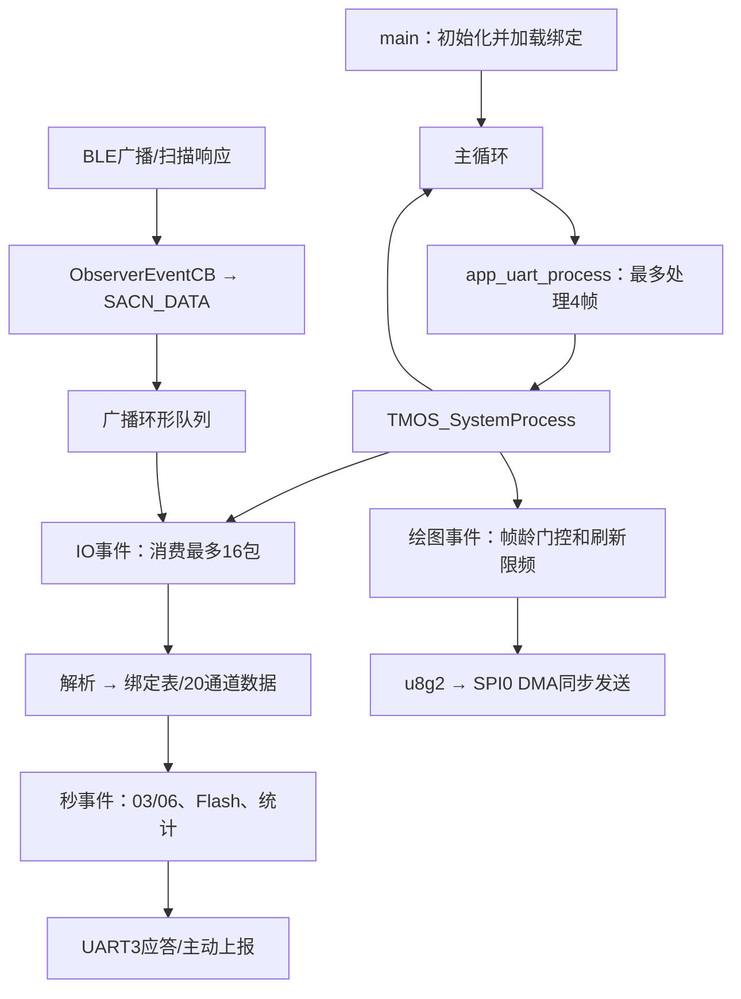

# 当前工程代码功能说明

检查日期：2026-09-27。依据当前工程源码、头文件、IDE配置和链接脚本整理。本文描述实际执行路径；源码注释中的历史测试、性能估算和外部STM32工程结论不作为本次验证结果。

## 1. Git状态和分析边界

- 仓库根目录：`D:\蓝牙模块优化`，已初始化Git，当前分支为默认的`master`。
- 本次新增根目录`.gitignore`及本说明；未改动固件源文件和工程设置。
- 尚无初始提交，现有工程文件仍未跟踪；未配置远程仓库、未提交或推送。
- 忽略IDE的obj/Debug/Release输出和常见编译中间文件，保留SDK静态库、IDE配置、屏幕图标素材。
- 已完成应用功能与主要底层调用关系的源码检查。BLE及ISP静态库内部实现不可由本工程应用源码完全核验。
- 编译、测试、烧录、硬件运行、通信波形和掉电试验：**尚未验证**。本次没有改动固件，也没有执行下载或硬件控制。

## 2. 工程定位与配置

这是一个WCH RISC-V、NoneOS工程，核心工作是接收BLE传感器广播，维护应用层绑定与20通道数据，通过UART3和外部主控交换页面/传感器信息，并驱动单色显示屏。界面标题为“矿用巷道综合测站”。

当前BLE路径使用Observer角色。“绑定”指MAC、名称、类型和通道的本地记录；该路径没有建立传感器BLE连接、执行配对认证或通过GATT读取传感器数据。

| 项目 | 当前配置及依据 |
|---|---|
| IDE工程名 | CH584M_TFT_HB；[.project](D:/蓝牙模块优化/CH584_V1_0_1/.project:3) |
| 器件配置 | .template指定MCU=CH584M，CONFIG.h的CHIP_ID为ID_CH585，启动文件和调试SVD使用CH585系列；这是命名/系列配置混用，实际芯片需查板卡 |
| 构建系统 | MounRiver/Eclipse CDT管理式RISC-V GCC，GNU99，优化大小；[.cproject](D:/蓝牙模块优化/CH584_V1_0_1/.cproject:15) |
| 构建目录 | obj；仓库当前没有生成的Makefile和构建产物 |
| 编译宏 | DEBUG=1、DCDC_ENABLE=1、BLE_MEMHEAP_SIZE=1024*20；[.cproject](D:/蓝牙模块优化/CH584_V1_0_1/.cproject:83) |
| BLE堆 | 按IDE配置为20KB，不能只按CONFIG.h默认6KB解释 |
| 静态库 | 实际链接ISP585和CH58xBLE；另有libCH58xBLE_PERI.a文件，未在当前链接库列表中启用；[.cproject](D:/蓝牙模块优化/CH584_V1_0_1/.cproject:108) |
| BLE头文件版本标识 | CH585_BLE_LIB_V1.4；[LIB/CH58xBLE_LIB.h](D:/蓝牙模块优化/CH584_V1_0_1/LIB/CH58xBLE_LIB.h:156)。程序初始化会比较库/头文件版本，实际运行比较结果尚未验证 |
| 链接存储空间 | FLASH 448KB、RAM 96KB；[Ld/Link.ld](D:/蓝牙模块优化/CH584_V1_0_1/Ld/Link.ld:5) |
| 主时钟 | main调用SetSysClock(SYSCLK_FREQ)，默认SYSCLK_FREQ选择78MHz；[StdPeriphDriver/inc/CH58x_common.h](D:/蓝牙模块优化/CH584_V1_0_1/StdPeriphDriver/inc/CH58x_common.h:70) |
| RTC时基 | 默认内部32K，供TMOS时基；[HAL/RTC.c](D:/蓝牙模块优化/CH584_V1_0_1/HAL/RTC.c:162) |
| 调试输出 | DEBUG=1映射UART1，默认115200；[StdPeriphDriver/CH58x_sys.c](D:/蓝牙模块优化/CH584_V1_0_1/StdPeriphDriver/CH58x_sys.c:554) |
| 当前关闭的HAL功能 | HAL_SLEEP/HAL_KEY/HAL_LED均默认FALSE；HAL/KEY.c和HAL/LED.c被IDE排除 |

注意：`FREQ_SYS`默认62400000，而`SYSCLK_FREQ`选择78MHz；`mDelayuS()`按FREQ_SYS编译分支实现。二者一致性和实际延时应专门核验，不能把注释中的初始化毫秒数视作实测。

## 3. 目录与模块职责

| 模块 | 职责 | 主要入口 |
|---|---|---|
| APP/observer_main.c | 电源/时钟、调试口、BLE、HAL、显示、FIFO和任务初始化，开机恢复绑定，主循环 | [main()](D:/蓝牙模块优化/CH584_V1_0_1/APP/observer_main.c:65) |
| APP/observer.c | BLE扫描、广播缓存与解析、绑定/通道管理、数据新鲜度、名字异常、统计诊断 | [Observer_Init()](D:/蓝牙模块优化/CH584_V1_0_1/APP/observer.c:310) |
| APP/Usart3_task.c | UART3接收中断、协议处理、UI事件、绑定存储调度、0x03应答与0x06上报 | [app_uart_process()](D:/蓝牙模块优化/CH584_V1_0_1/APP/Usart3_task.c:350) |
| APP/app_drv_fifo.c | 软件环形FIFO，寻找帧头、收齐帧、校验并提取整帧 | [app_drv_fifo_read_pack()](D:/蓝牙模块优化/CH584_V1_0_1/APP/app_drv_fifo.c:234) |
| APP/yuying_TFT.c | 页面绘制、中文/数字格式、提示页、u8g2到GPIO/SPI适配 | [UI_Control()](D:/蓝牙模块优化/CH584_V1_0_1/APP/yuying_TFT.c:330) |
| APP/Flash.c | 现行绑定镜像保存/加载/清除；文件前部另有未进入现行调用链的旧存储函数 | [binding_store_save()](D:/蓝牙模块优化/CH584_V1_0_1/APP/Flash.c:480) |
| HAL/MCU.c、RTC.c | BLE库初始化、TMOS时钟和周期RF/内部RC校准 | [HAL_Init()](D:/蓝牙模块优化/CH584_V1_0_1/HAL/MCU.c:256) |
| LIB | BLE接口头文件、预编译协议栈、调度汇编 | [LIB/CH58xBLE_LIB.h](D:/蓝牙模块优化/CH584_V1_0_1/LIB/CH58xBLE_LIB.h:84) |
| StdPeriphDriver | WCH GPIO、UART、SPI、ADC、定时器、USB等外设驱动和ISP库 | [StdPeriphDriver/inc/CH58x_common.h](D:/蓝牙模块优化/CH584_V1_0_1/StdPeriphDriver/inc/CH58x_common.h:50) |
| Startup、RVMSIS、Ld | 启动、向量、RISC-V内核接口及存储布局 | [Startup/startup_CH585.S](D:/蓝牙模块优化/CH584_V1_0_1/Startup/startup_CH585.S:142) |
| u8g2 | 图形绘制、字库和显示控制器驱动 | [u8g2/u8g2_d_memory.c](D:/蓝牙模块优化/CH584_V1_0_1/u8g2/u8g2_d_memory.c:95) |
| log | 四张信号状态BMP素材，属于工程资源，应保留 |

SDK里存在USB、PWM、I2C等驱动不代表产品应用已经启用相应功能。应用明确使用的硬件链路集中在BLE、UART1/UART3、SPI0/GPIO、RTC、Data-Flash；内部ADC温度采样用于BLE校准。

## 4. 开机及主循环

开机顺序来自[APP/observer_main.c](D:/蓝牙模块优化/CH584_V1_0_1/APP/observer_main.c:65)：

1. 按编译配置启用DCDC，设置HSE电容和系统时钟。
2. 配置UART1调试口，延时后打印BLE库版本。
3. CH58x_BLEInit：配置协议栈堆、缓冲、Flash回调、校准回调等。
4. HAL_Init：注册HAL任务，初始化RTC/TMOS时基，安排校准事件。
5. u8g2Init：初始化ST7305显示并发送清屏缓冲。
6. 初始化512字节串口软件FIFO，初始化UART3，注册串口/UI任务。
7. 初始化Observer角色并注册扫描任务。
8. binding_store_load：在主循环启动前恢复绑定和通道占用。
9. 进入主循环，交替调用app_uart_process和TMOS_SystemProcess。



TMOS是协作式事件调度。UART发送、显示初始化、整屏传输和Flash操作仍有同步阻塞；转移到秒事件只是改变执行位置和触发频率，不能保证BLE完全不受延迟影响。

## 5. 硬件接口与任务节拍

| 接口 | 源码配置 | 依据/边界 |
|---|---|---|
| UART3主控通信 | PA5 TX、PA4 RX，115200、8N1 | [APP/Usart3_task.c](D:/蓝牙模块优化/CH584_V1_0_1/APP/Usart3_task.c:391) |
| UART1调试 | PA9 TX、PA8 RX，115200 | [APP/observer_main.c](D:/蓝牙模块优化/CH584_V1_0_1/APP/observer_main.c:83) |
| 屏幕SPI0 | PA13 SCK、PA14 MOSI，PA12 CS | 默认复用映射及TFT_IO_init；[APP/yuying_TFT.c](D:/蓝牙模块优化/CH584_V1_0_1/APP/yuying_TFT.c:1915) |
| 屏幕DC | PA2 | [APP/include/yuying_TFT.h](D:/蓝牙模块优化/CH584_V1_0_1/APP/include/yuying_TFT.h:8) |
| 屏幕RST定义 | PA3 | 配置为高电平，GPIO reset回调为空，未执行硬件复位脉冲 |
| 额外GPIO | PA1置高、PB0/PB1置低并设输出 | 此段没有给出实际硬件用途，不能据此推断供电控制 |
| Data-Flash绑定 | 偏移0的4096字节块 | [APP/Flash.c](D:/蓝牙模块优化/CH584_V1_0_1/APP/Flash.c:436) |
| BLE SNV | 偏移0x7000，默认256字节×1 | 与现行绑定块分开 |

以上是源码映射，不是实际布线验证；晶振、射频、供电和调试端口的物理接线需要硬件资料。

| TMOS事件 | 名义节拍 | 执行内容 |
|---|---|---|
| IO事件 | 首次500ms，后续10ms | 广播队列消费、刷新时基；每20次请求本地刷新 |
| DATA事件 | 20ms | 消费绘图请求；绘图最少间隔5个IO节拍 |
| TIMER事件 | 1s | 帧龄、FIFO超时、页面绑定模式、Flash、提示、03/06、名字巡检及BLE诊断 |
| HAL校准事件 | 初次800 tick，之后120000ms配置 | RF及内部RC校准 |

依据[APP/Usart3_task.c](D:/蓝牙模块优化/CH584_V1_0_1/APP/Usart3_task.c:432)及[APP/Usart3_task.c](D:/蓝牙模块优化/CH584_V1_0_1/APP/Usart3_task.c:661)。节拍按SDK 0.625ms单位计算，实际执行时间会受阻塞和事件负载影响。

## 6. BLE扫描、设备名称与绑定

### 扫描和缓存

- 主动扫描全部设备，不使用白名单。
- 当前实际扫描时长12800 tick，即8秒，扫描完成回调立即重新启动；间隔和窗口均240，即150ms/150ms。
- 源码注释写“0关闭超时持续扫描”，但当前0宏被注释掉，必须按8秒重启理解。
- 广播回调仅把地址、事件类型、RSSI和最多64字节原始包复制到队列。
- 队列64个槽，留一个空槽，实际最多63包；满时丢最新包并统计。
- IO事件每次最多消费16包，随后才解析和填数据。注释中的1600包/秒、延迟≤10ms是估算，尚未实测。

主要依据：[APP/observer.c](D:/蓝牙模块优化/CH584_V1_0_1/APP/observer.c:35)、[APP/observer.c](D:/蓝牙模块优化/CH584_V1_0_1/APP/observer.c:409)、[APP/observer.c](D:/蓝牙模块优化/CH584_V1_0_1/APP/observer.c:2033)。

### 绑定页控制

每次秒事件满足以下条件才进入绑定模式：

```c
menu_rank == 3 && rank2_addr == 2 && UI_main.re_flag == 2
```

其他页面采用数据模式。绑定模式由当前页面决定，不再使用开机30秒窗口。判断在秒事件中更新，队列按消费时的模式处理。

- DATA：只处理已绑定MAC的数据，本包没有名称也可以。
- BIND：本包必须带符合SW名称筛选的名字；尝试绑定后更新数据。
- 绑定模式没有把不同ADV/SCAN_RSP中的名称和数据拼成一条设备记录。

### 名称规则与类型

AD名称优先0x09完整名，其次0x08简称；选择包含SW_的名称，最长保存29字节和结束符。核心格式：

```text
SW_<类型>_<主机号>_<起始通道>[_<结束通道>]
例如 SW_MG_1_1，SW_WY_1_2_5
```

通道名义范围1..20，内部保存0..19索引。起止范围决定占用数量；省略结束通道默认1个。主机号存入记录，当前没有按主机号过滤设备。

| 名称类型 | 用途 | 特殊处理 |
|---|---|---|
| MG | 锚杆 | 通用数据格式 |
| JG | 激光 | 根据payload决定1或4通道 |
| WY | 位移 | 4/6/8通道对应WY4/WY6/WY8，其余归WY2 |
| LF | 裂缝 | 通用数据格式 |
| QJ | 倾角 | 原始16位数据在显示时按有符号解释 |
| YL | 应力 | 通用数据格式 |
| YW | 液位 | 通用数据格式 |
| WZ | 微震 | 通用数据格式 |
| DY | 地音 | 通用数据格式 |
| KK | 测试 | 通用数据格式 |

依据[APP/observer.c](D:/蓝牙模块优化/CH584_V1_0_1/APP/observer.c:593)和[APP/observer.c](D:/蓝牙模块优化/CH584_V1_0_1/APP/observer.c:649)。枚举存在不等于类型/通道数量组合均被严格验证。

### 绑定状态

绑定表最多32条MAC，实际通道容量20。每条保存名字、MAC、类型、主机号、起始索引和通道数；每通道保存类型、数值、电压、RSSI和valid等。

- 新MAC：检查同名、容量、通道剩余数量和区间冲突，成功后占用通道、设置自动保存dirty。
- 同MAC字段相同：复用记录。
- 同MAC名字、类型或通道变化：保留原绑定布局，继续按旧记录解释数据。
- 解绑清除绑定、通道及相关告警/采集状态；未清广播队列，也不会立即退出绑定模式。

依据[APP/observer.c](D:/蓝牙模块优化/CH584_V1_0_1/APP/observer.c:1000)、[APP/observer.c](D:/蓝牙模块优化/CH584_V1_0_1/APP/observer.c:1479)。

## 7. 传感器数据、状态与上报

厂商数据只取第一个AD类型0xFF字段，字段内容全部作为自定义payload；此处没有验证公司ID，也没有跳过固定公司ID字节。

| 设备 | 数据解析 |
|---|---|
| JG | 至少9字节：激光2字节、三个倾角各2字节、电压1字节，数值均大端 |
| JG通道判定 | 三个倾角均为0xFDFD时占1通道，否则占4通道；第一通道JG，后三个QJ |
| 其他类型 | 至少2×通道数+1字节，依次读取大端16位数；电压取整个payload最后一字节，多余中间数据忽略 |

有效写入后更新CH_data、电压、RSSI、fresh和本轮通道位图，并将设备miss清零。RSSI以原始字节保存，UI转回int8_t显示负dBm。

0x03是请求一轮数据：受理后清fresh，所有miss<3的绑定设备都收到新数据时应答；否则等到30个秒事件后使用当前缓存应答。在途重复请求忽略。应答后未收到新数据的设备miss加1，封顶3；达到3只是不再等待，**不会清掉旧数据或valid**。这是0x03请求轮数机制，不是独立实时离线定时器。

0x06是主动上报：有绑定时，全部在用通道位图收齐，或有新数据且距上次上报达到10个秒事件，就发送一次并清本轮位图。没有绑定时不上报。0x06不推进miss。

额外监测：

- 每600个秒事件比较已绑定MAC的名称快照和旧绑定名，错误记录最多16条、满时环形覆盖；不写Flash。
- 只捕获符合SW_筛选的名字；改成不含SW_的名称不能由这条路径告警。
- 电压原始字节为0时计异常，同一次填包只计一次，累加封顶255；统计的是异常包次数，不能当成异常设备数量或已验证的欠压阈值。

依据[APP/observer.c](D:/蓝牙模块优化/CH584_V1_0_1/APP/observer.c:1180)、[APP/observer.c](D:/蓝牙模块优化/CH584_V1_0_1/APP/observer.c:1320)、[APP/observer.c](D:/蓝牙模块优化/CH584_V1_0_1/APP/observer.c:829)、[APP/observer.c](D:/蓝牙模块优化/CH584_V1_0_1/APP/observer.c:1755)。

## 8. UART协议

```text
AA EE | LEN_H LEN_L | CMD | DATA... | SUM | 0A
LEN = 1字节CMD + DATA长度，大端
SUM = CMD至DATA末字节的累加和，取低8位
整帧长度 = LEN + 6
```

接收中断只搬运数据，主循环通过512字节FIFO查找完整帧。每次主循环最多提取4帧；发送采用轮询硬件FIFO的阻塞函数。

| 命令 | 实际功能 | 结果 |
|---|---|---|
| 0x01 | UI页面、参数、提示；请求屏幕重新初始化 | 不回串口应答 |
| 0x02 | 保留空分支 | 无实际动作 |
| 0x03 | 请求一轮传感器数据 | 收齐或超时后返回87字节 |
| 0x04 | 解绑全部 | RAM立即清除并回状态，Flash在秒事件中清除 |
| 0x05 | 手动保存绑定 | 同步擦写和回读校验，返回00成功/01无绑定/02失败 |
| 0x06 | 主动上报一轮数据 | 只发送，接收侧没有该case |
| 0x07 | 本机绑定恢复出厂 | 当前同步清RAM和Flash；不是重置STM32全部参数 |
| 其他CMD | 未实现 | default静默忽略；没有0x08/0x09/0x10命令 |

0x03/04/05/07请求只含CMD，固定7字节；0x04/05/07应答带1字节状态，固定8字节。0x04/07状态00/01只表示清除前是否有绑定，不包含Flash失败状态。

0x03和0x06共用载荷：

```text
AA EE | 00 51 | 03或06 |
20 × [type, data_H, data_L, voltage] |
SUM | 0A
```

固定20通道、80字节载荷、87字节整帧；没有RSSI、fresh、离线位、MAC或名字。组包只检查valid和Type!=NONE，恢复绑定后尚未接收到数据也可能发送有效类型和0数值；掉线继续发送缓存旧值。

0x01的数据部分为Type、menu_rank、rank2、rank3、param_cnt及大端u16参数。普通正确格式LEN=6+2×param_cnt，最多30参数。页面状态由主控传入，CH584负责显示和本地BLE逻辑。

提示码8/9通过**CMD01、menu_rank=6**发送：分别显示“长按K1+K3开机”和“正在关机中”。它们不是独立CMD，也不能证明本机执行了按键检测或电源切断。

依据[APP/app_drv_fifo.c](D:/蓝牙模块优化/CH584_V1_0_1/APP/app_drv_fifo.c:234)、[APP/Usart3_task.c](D:/蓝牙模块优化/CH584_V1_0_1/APP/Usart3_task.c:721)、[APP/Usart3_task.c](D:/蓝牙模块优化/CH584_V1_0_1/APP/Usart3_task.c:796)、[APP/Usart3_task.c](D:/蓝牙模块优化/CH584_V1_0_1/APP/Usart3_task.c:888)。

## 9. 显示和页面功能

当前启用ST7305 168×384驱动，使用U8G2_R3旋转，界面384×168；全帧缓冲8064字节。ST7306备用初始化只发现定义和声明，没有当前调用。

SPI0通过DMA传输，但驱动等待完成标志，因此绘图仍同步阻塞。显示信息里的2MHz和驱动注释里的8MHz均不能直接作为实际总线频率；适配层使用SPI0默认初始化、分频寄存器为4，实际波形尚未验证。

| 页面/菜单 | 功能与数据来源 |
|---|---|
| 主页 | 主机/分站/发往地址、LoRa信号、版本、电池、状态；本地20通道分两页，每页10项；绑定数和告警统计 |
| 地址分区 | 显示主控下发的地址和分区，保存重启/不保存返回 |
| 组网测试 | 显示开始/返回/重置/保存和测试地址、次数、成功率；本工程未实现LoRa射频组网驱动 |
| 设备绑定 | 已绑定数量/名称/MAC、解绑确认、最近扫描名、保存/返回；进入绑定子页影响BLE模式 |
| 安装调试 | 20通道的RSSI及设备电压 |
| 上传设置 | 三组旧/新上传地址 |
| 其他设置 | 通信功率、亮屏时间、通信状态、保存/返回 |
| 信息汇总 | 通道绑定名称、名称变更和电压异常统计、恢复出厂确认 |
| 返回主页 | 由主控页面状态配合显示 |
| 保存/关机提示 | 提示层覆盖普通页面；普通提示倒数，关机提示常驻直到msg0清除 |

菜单绘图不自行发送主控命令，不自行执行参数标定、上传或关机。旧探头标定、置零函数仍存在，但未挂入当前八项菜单函数表；主控工程未提供，相关端到端行为尚未核验。

主页对锚杆、位移、应力、倾角除10后按整数显示，倾角先转int16_t；不能描述成保留一位小数。电压调试页按原始字节除10显示一位小数V，物理电压编码需设备协议或测量确认。

刷新控制：

- 最近0x01帧龄≤5个秒事件才绘图，超过则停止后续刷新；BLE采集/上报/保存继续。
- 本地周期每20个IO事件请求刷新，名义200ms；绘图最小间隔5个IO事件，名义50ms。
- 开机仍无条件初始化和清屏，不能称“没收到主控帧时完全不访问屏幕”。
- “息屏”在本机代码中是停止刷新，不能证明已关闭屏幕供电。
- 秒事件中现有缺大括号结构实际每次都置绘图请求，仍受上述帧龄门控。

依据[APP/yuying_TFT.c](D:/蓝牙模块优化/CH584_V1_0_1/APP/yuying_TFT.c:52)、[APP/yuying_TFT.c](D:/蓝牙模块优化/CH584_V1_0_1/APP/yuying_TFT.c:424)、[APP/yuying_TFT.c](D:/蓝牙模块优化/CH584_V1_0_1/APP/yuying_TFT.c:1804)、[APP/Usart3_task.c](D:/蓝牙模块优化/CH584_V1_0_1/APP/Usart3_task.c:472)。

## 10. 绑定掉电保存

现行Data-Flash镜像固定1288字节，擦除范围4096字节：

| 偏移 | 字段 |
|---|---|
| 0..3 | magic CHBD |
| 4 | 版本1 |
| 5 | 绑定条数 |
| 6..7 | 全镜像16位累加和，小端；计算跳过本字段 |
| 8起，每条40字节 | MAC6、名字30、类型1、主机号1、起始索引1、通道数1 |
| 未使用记录区 | 填0，仍参与校验 |

保存流程：组镜像→擦除→写入→回读逐字节比较。写失败会再擦写一次。无绑定返回EMPTY，不会通过save清除旧镜像。

新绑定只置dirty，秒事件合并自动保存；不是等待最后一次变化后稳定若干秒的严格去抖。手动0x05同步保存并反馈结果。

开机加载先清RAM，再检查magic、版本、条数、全镜像校验；这些失败则无绑定。逐条无效MAC、字段或冲突则跳过该条，保留已恢复的其他条，**不是任意一条失败就清空全部**。恢复重建通道占用，实时值仍等待广播。

镜像只用单块擦后写，没有双备份或提交标记；中途掉电可能丢失已保存绑定。累加和不具备CRC等同的检错能力。旧Flash函数使用不同布局，不应直接复用到当前持久化路径。

依据[APP/Flash.c](D:/蓝牙模块优化/CH584_V1_0_1/APP/Flash.c:436)、[APP/Flash.c](D:/蓝牙模块优化/CH584_V1_0_1/APP/Flash.c:480)、[APP/Flash.c](D:/蓝牙模块优化/CH584_V1_0_1/APP/Flash.c:577)、[APP/observer.c](D:/蓝牙模块优化/CH584_V1_0_1/APP/observer.c:1520)。

## 11. 后续优化需要关注的源码问题

以下没有在本次修改或修复，也未做现场故障复现。源码确定的逻辑问题与需要实测的风险分列说明：

| 问题 | 证据与影响 |
|---|---|
| UART触发配置写错实例 | [APP/Usart3_task.c](D:/蓝牙模块优化/CH584_V1_0_1/APP/Usart3_task.c:410)调用UART1_ByteTrigCfg；UART3实际仍默认4字节触发，trigB=7不能代表硬件阈值 |
| FIFO满/空混淆 | [APP/app_drv_fifo.c](D:/蓝牙模块优化/CH584_V1_0_1/APP/app_drv_fifo.c:17)长度被mask限制0..511，write却允许填满512，满后长度变0；is_full比较512永不成立，存在覆盖路径 |
| 主页参数数量检查不足 | [APP/Usart3_task.c](D:/蓝牙模块优化/CH584_V1_0_1/APP/Usart3_task.c:992)只检查至少5个，却读取10个固定参数；5..9个参数帧读取未初始化数组元素 |
| 解析非原子更新 | [APP/Usart3_task.c](D:/蓝牙模块优化/CH584_V1_0_1/APP/Usart3_task.c:972)在页面字段验证完前清帧龄并更新页面；调用方不检查返回码 |
| 0x01长度约束不足 | [APP/Usart3_task.c](D:/蓝牙模块优化/CH584_V1_0_1/APP/Usart3_task.c:946)用整数除法推参数数目，没有直接验证LEN=6+2N；固定字段访问也先于最小结构长度检查 |
| 通道数字先截断再校验 | [APP/observer.c](D:/蓝牙模块优化/CH584_V1_0_1/APP/observer.c:683)先转uint8再检查1..20，例如名字中的257可能按1接受 |
| 绑定时名字/数据分包 | [APP/observer.c](D:/蓝牙模块优化/CH584_V1_0_1/APP/observer.c:1831)无名字直接返回；JG新绑定要求同包9字节payload，分开ADV/SCAN_RSP时可能无法绑定 |
| 自动保存失败状态丢失 | [APP/Usart3_task.c](D:/蓝牙模块优化/CH584_V1_0_1/APP/Usart3_task.c:623)先清dirty并忽略save结果；没有恢复dirty来安排后续重试。save内部只对一次写失败重试 |
| 0x07同步擦除且结果语义有限 | [APP/Usart3_task.c](D:/蓝牙模块优化/CH584_V1_0_1/APP/Usart3_task.c:1382)直接擦Flash，和“04/07均延期”注释不符；应答不报告Flash擦除失败 |
| 秒事件缺大括号 | [APP/Usart3_task.c](D:/蓝牙模块优化/CH584_V1_0_1/APP/Usart3_task.c:579)提示倒数if实际套住后面的绑定if，独立块无条件请求绘图；门控仍生效 |
| 离线与无数据没有协议字段 | [APP/Usart3_task.c](D:/蓝牙模块优化/CH584_V1_0_1/APP/Usart3_task.c:822)valid/type即可回数值；miss达到3也保留缓存，接收端难区分恢复后零值、真实零和旧值 |
| 解绑后可能重新绑定 | [APP/observer.c](D:/蓝牙模块优化/CH584_V1_0_1/APP/observer.c:1479)清表未清广播队列、未立即退出BIND；结果依赖页面/广播时序 |
| UART FIFO并发边界 | ISR与主循环共用普通begin/end，flush同时清二者；竞态实际影响尚未复现，需结合编译结果和压测 |
| 存储恢复语义检查不完整 | 未重新验证名称/host/类型通道匹配及MAC唯一性；同MAC重叠区间可接受，需要异常镜像测试 |
| 单块保存掉电窗口 | 擦后写无原子提交；0x04先应答后擦除也有尚未擦除时掉电恢复旧记录的窗口 |
| 延时/日志/同步传输负载 | 时钟宏不一致；BLE_DIAG_LOG当前为1，每5个秒事件打印状态和名称；SPI、Flash、UART均有阻塞，应实测主循环延迟 |

“无广播10秒重新启动扫描”的看门狗存在；初次启动和正常扫描完成重启未处理返回码。诊断reject计数不涵盖名称解析失败等全部拒绝原因，不能只靠该计数确认设备格式正确。

## 12. 现阶段验证结论和最短人工检查

已验证：Git仓库初始化、IDE与链接配置、应用入口、主要调用关系、协议组包/解析、引脚源码配置、显示路径及存储布局；新增说明中的链接按实际文件核对。

尚未验证：

- MounRiver完整编译与最终Flash/RAM占用。
- 对端主控的实际命令格式、类型枚举、按键及LoRa/供电行为。
- BLE广播实际格式、名称/厂商段分包方式、射频接收和丢包率。
- 屏幕SPI波形、复位要求、刷新效果和物理供电状态。
- Flash擦写、掉电恢复和满负载下的时序。

最短验证顺序：在MounRiver导入当前工程并构建，检查错误/警告和存储占用；在已具备硬件操作授权的测试环境中，先核对UART3 115200帧，再用已知广播设备检查绑定/通道/03/06，最后验证保存后重启恢复与解绑后重启不恢复。实际烧录和硬件动作应按当时授权单独执行。

本次仅完成Git初始化与代码理解，保留所有上述固件行为供后续有针对性的优化。

